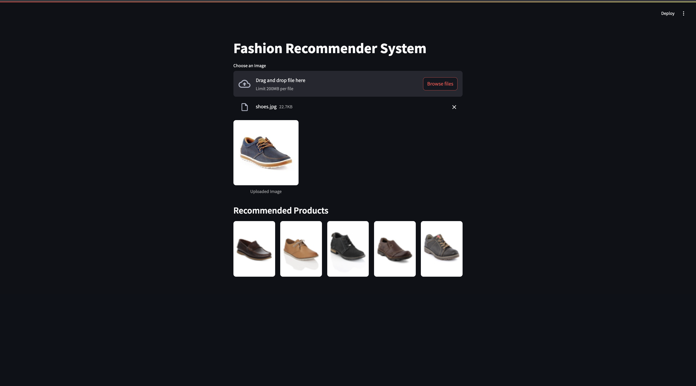

# Fashion Product Image Recommender System

This project is a **content-based image recommender system** that suggests visually similar fashion products using deep learning. It uses **ResNet50** to extract embeddings from product images and provides two options for similarity search:

- **FAISS** for fast approximate nearest neighbor retrieval
- **scikit-learn NearestNeighbors** for exact brute-force comparison

The app is built with **Streamlit** to allow interactive image uploads and real-time recommendations.

##  Preview



> Upload a fashion image (e.g., shirt, shoe, etc.) and instantly get the 5 most visually similar products from the dataset.

##  Dataset

We use the [Fashion Product Images (Small)](https://www.kaggle.com/datasets/paramaggarwal/fashion-product-images-small) dataset from Kaggle.

This version contains:
- **44,000+ smaller-sized fashion product images**, optimized for faster processing
- Various categories such as shirts, shoes, dresses, jeans, and more

Due to computational constraints, we used the **lower-resolution images** provided in this subset.  
After downloading, extract all images into a folder named `images/` at the root of the project.

##  Project Structure

- `images/` – Folder containing all 44,000 product images (from Kaggle dataset)
- `sample/` – Folder containing sample query images (e.g., shirt.jpg, ball.jpg)
- `uploads/` – Temporary folder where uploaded images are saved during Streamlit session
- `app.py` – Script to extract ResNet50 embeddings and save them as `.pkl` files
- `test.py` – FAISS-based script for fast nearest neighbor search and visualization
- `test2.py` – Brute-force nearest neighbor search using scikit-learn
- `main.py` – Streamlit web app for image upload and recommendations
- `requirements.txt` – Lists all required Python dependencies
- `README.md` – Project documentation
- `assets/app_screenshot.png` – Screenshot of the running web app

> The `embeddings.pkl` and `filenames.pkl` files will be **generated automatically** by running `app.py`.

## Setup Instructions

### 1. Install Dependencies

Make sure you have Python 3.8 or higher. Then install all required libraries using:

```bash
pip install -r requirements.txt
 ```

### 2. Download and Prepare Dataset
Download the Fashion Product Images (Small) dataset from Kaggle.

Extract all image files into a folder named images in the root directory of the project.

⚠️ Do not upload the dataset or .pkl files to GitHub.
The embeddings.pkl and filenames.pkl files will be automatically generated by running app.py.

##  Run Instructions

### 1. Generate Embeddings

To begin, run the `app.py` script. This will extract feature vectors from all images using the ResNet50 model and save them into two files: `embeddings.pkl` (containing the image embeddings) and `filenames.pkl` (containing corresponding image paths). These files are essential for both the recommendation system and testing scripts.

---

### 2. Launch the Web Application

Once the embeddings are generated, run the `main.py` script to launch the Streamlit-based web application. The app allows users to upload a fashion product image and instantly displays the top 5 visually similar product recommendations.

---

### 3. Optional: Run Test Scripts

You can also explore similarity search using standalone scripts:
- Run `test.py` to perform FAISS-based fast nearest neighbor search with visual output.
- Run `test2.py` to use brute-force nearest neighbor search via scikit-learn and display results using OpenCV.

## 📌 Technologies Used

- **TensorFlow / Keras** – For deep learning and feature extraction using the ResNet50 model
- **FAISS** – Facebook AI Similarity Search library for fast nearest neighbor retrieval
- **scikit-learn** – For brute-force k-nearest neighbor search
- **Streamlit** – To build the interactive web application
- **NumPy** – For numerical operations and array management
- **Pillow (PIL)** – For image handling and preprocessing
- **OpenCV** – For image display in test scripts
- **Matplotlib** – For visualizing search results
- **tqdm** – For progress tracking during feature extraction

## 🧾 Notes

- The image dataset and generated `.pkl` files are **not included** in this repository due to their size.
- Make sure to download the dataset manually and run `app.py` to generate the required files before using the app or test scripts.
- For best results, upload images that are visually centered and clearly represent the product.

---

## 🧑‍💻 Author

**Ananay Singh**  
Built as part of a self-initiated project using deep learning and efficient search techniques for fashion image recommendation.

**Dataset:** [Fashion Product Images (Small) – Kaggle](https://www.kaggle.com/datasets/paramaggarwal/fashion-product-images-small)
